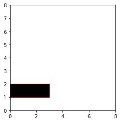
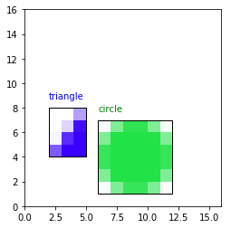
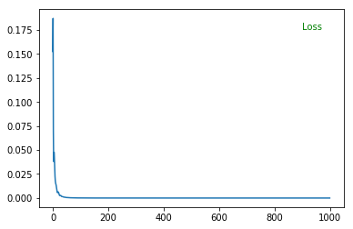
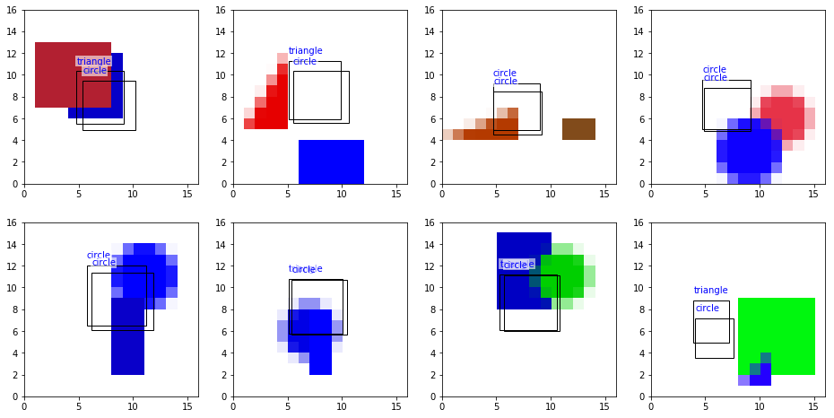
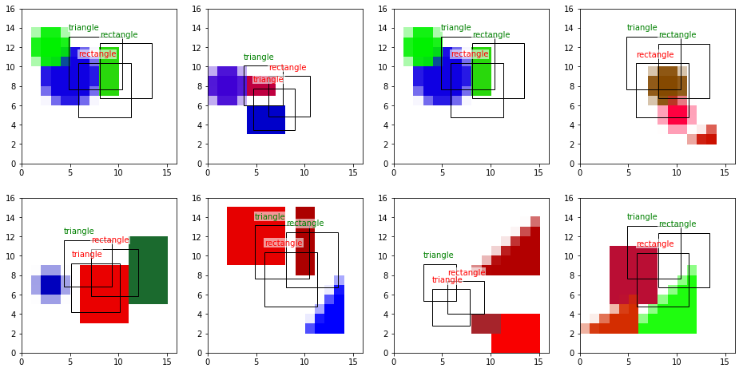

# Conditional-DCGAN using Pytorch
This repository is built to understand object detection and bounding box from scratch. Here we implemet a simple geomentrical shape detection and construct a bounding box over the object. This is just a toy example.
 
Refrence:[Pytorch](https://pytorch.org/)<br/>
         [REF paper](https://arxiv.org/abs/1512.02325)  

## Requirements
	 1. Pytorch
	 2. Pycairo

## Usage

### Prepare Training Dataset 

> To generate random Rectangles
```python

bboxes = np.zeros((num_imgs, num_objects, 4))
imgs = np.zeros((num_imgs, img_size, img_size))  # set background to 0
for i_img in range(num_imgs):
    for i_object in range(num_objects):
        w, h = np.random.randint(min_object_size, max_object_size, size=2)
        x = np.random.randint(0, img_size - w)
        y = np.random.randint(0, img_size - h)
        imgs[i_img, x:x+w, y:y+h] = 1.  # set rectangle to 1
        bboxes[i_img, i_object] = [x, y, w, h]
```



Similarly, we generate images of multiple objects with their bounding boxes
 


###  Architecture

#### Single bounding box

```javascript

LinearRegressionModel(
  (linear1): Linear(in_features=64, out_features=200, bias=True)
  (linear2): Linear(in_features=200, out_features=4, bias=True)
)
```
#### Multiple bounding box and object classification

```javascript
----------------------------------------------------------------
        Layer (type)               Output Shape         Param #
================================================================
            Conv2d-1        [-1, 32L, 18L, 18L]             896
              ReLU-2        [-1, 32L, 18L, 18L]               0
         MaxPool2d-3          [-1, 32L, 9L, 9L]               0
            Conv2d-4        [-1, 64L, 11L, 11L]           18496
              ReLU-5        [-1, 64L, 11L, 11L]               0
         MaxPool2d-6          [-1, 64L, 5L, 5L]               0
            Conv2d-7         [-1, 128L, 7L, 7L]           73856
              ReLU-8         [-1, 128L, 7L, 7L]               0
         MaxPool2d-9         [-1, 128L, 3L, 3L]               0
           Linear-10                 [-1, 256L]          295168
             ReLU-11                 [-1, 256L]               0
          Dropout-12                 [-1, 256L]               0
           Linear-13                  [-1, 30L]            7710
================================================================
Total params: 396126
Trainable params: 396126
Non-trainable params: 0
----------------------------------------------------------------
None
```

### Training 

Run the jupyter notebooks to start the Training.

### Training Loss for Single Rectangle Bounding Box


###### Output for Single Rectangle Bounding Box


> The Single Single Rectangle Bounding Box showed and accuracy of 0.99998360718840895

###### Intermediate output for MultiObject Bounding Box

<br/>


Single Rectangle Bounding box is completed and the other works are in progress
#### ToDo
- [x] Single object BBox.
- [x] Save/Load checkpoint.
- [x] Multiple Object BBox withot flip.
- [ ] Multiple Object BBox with flipping 
